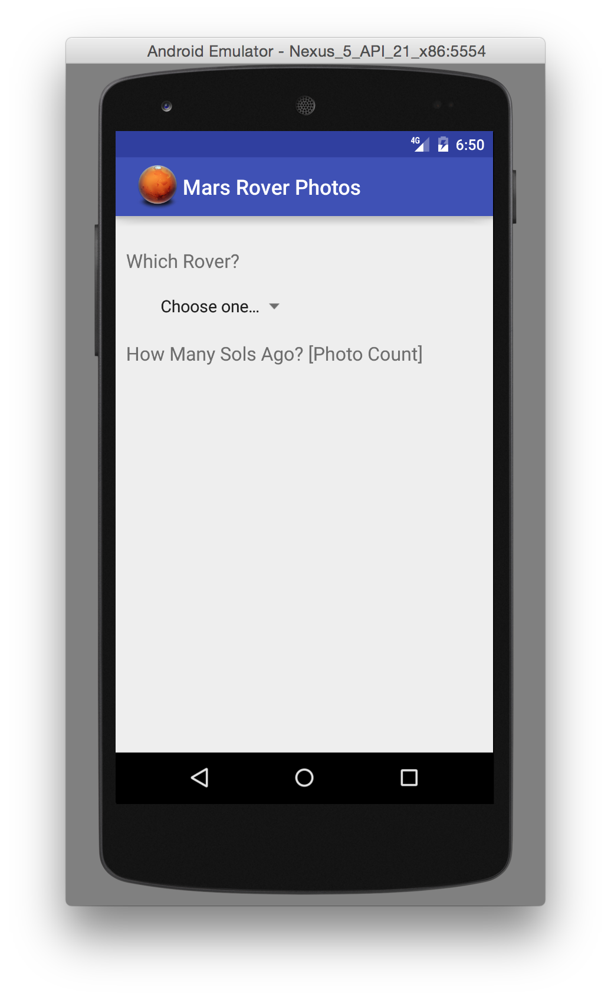
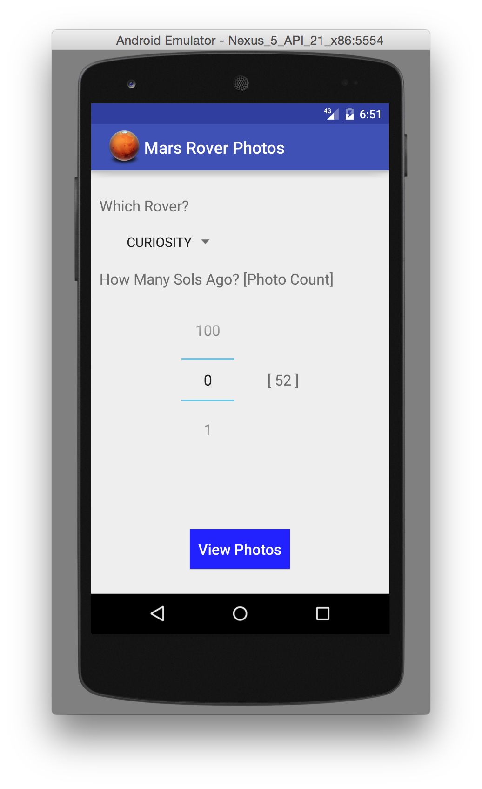
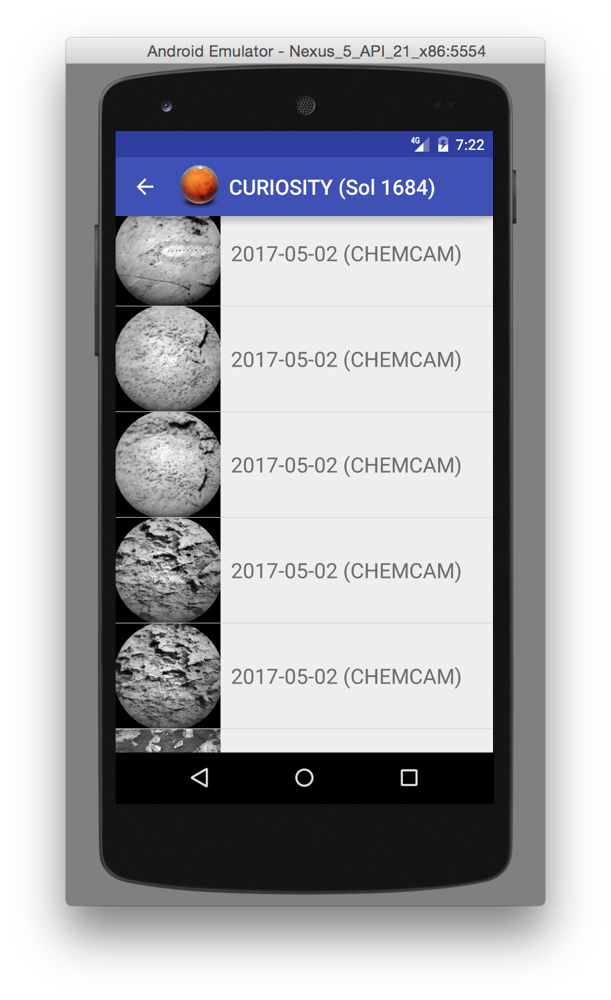
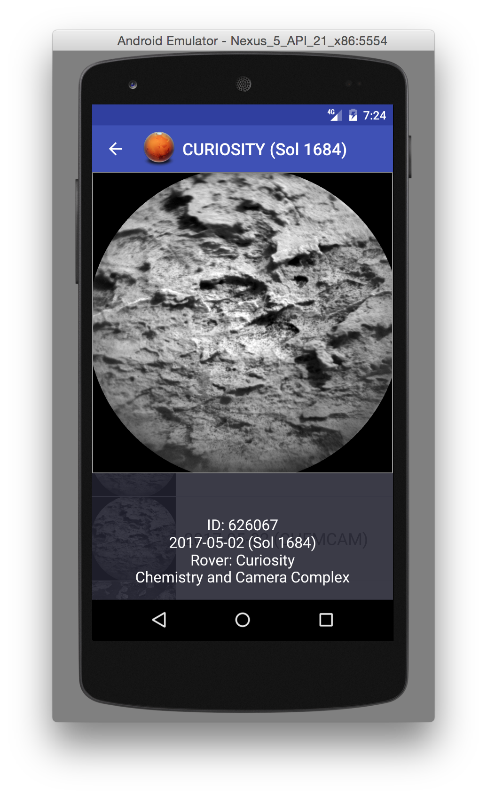

## Mars Rover Photos Android App

This is a sample Android application demonstrating the use of **Retrofit** and **Picasso** to pull data about photos from a JSON feed, show thumbnails in a list, and display full size images as the onClick for each list item.

The photos were taken by the **Mars Rovers** and are provided by **NASA** through a published API. ([https://api.nasa.gov/api.html#MarsPhotos](https://api.nasa.gov/api.html#MarsPhotos))

## Overview
First of all, if you've watched the film **The Martian** (starring Matt Damon), you may remember that days on Mars are not the same as Earth days, because Mars has a different period of rotation than Earth's. A day on Mars is designated as a *sol*. Many of the data points associated with NASA's photo feed are measured and counted in sols. Just thought I'd mention this up front...

There are three Rovers that NASA sent to Mars: **CURIOSITY**, **OPPORTUNITY**, and **SPIRIT**. CURIOSITY seems to have the most photos available and is still transmitting a substantial number of new photos back to Earth.

The feed provides two forms of feed data:

1. *manifests* for each Rover (in JSON format) that list the range of sols for which there are photos available (i.e., the range between the landing date and the most current date for which photos have been transmitted), as well as a count of how many photos there are for each sol, along with the total count of photos for this Rover.
1. *photo lists* - lists of information about the photos taken by a given Rover on a given sol. This information is also in JSON format, and includes for each photo:

	 * data about the Rover,
	 * data about which camera on the Rover took the photo,
	 * the corresponding Earth date,
	 * and of course the link pointing to the actual file on the NASA gallery server

## Application Flow

* The app starts out on the main screen which allows users to choose which Rover they want to work with.  

* Once a Rover is selected, the bottom half of the screen displays a NumberPicker for choosing how many sols ago the user wishes to see photos from.  

* On the right hand side, a number is displayed showing how many photos exist for each sol, so you can avoid choosing sols with few or no photos.
* The app derives which actual sol is to be queried by subtracting the user's choice in the NumberPicker from the `maxSol` value associated with the Rover. (e.g., if `maxSol` is 1000, and the user selected 7, the app would request photos taken on sol 993)
* Tapping the **View Photos** button takes the app to a new activity that displays a list of thumbnails for the available images.  

* Tapping on a thumbnail entry opens up a view that shows the full size image with a caption containing additional metadata associated with the photo.  

* Tapping anywhere on the screen removes the full size image and returns to presentation of the photo list. 

*****

## Local Caching

Caching the fetched data for offline usage is accomplished using custom caching code in the app as well as custom capabilities associated with the libraries used to fetch and present data.

* The Java objects composed from the fetched JSON are stored in an application-level cache.
* Also, the JSON contained in the response is saved in SharedPreferences keyed by the Rover name and sol number; this can be used as a substitute for going to the network for any rover/sol combination that has already been retrieved, when there is no network connection. 
* Retrofit is configured to make use of OkHttp caching automatically.
* Picasso, which is used to fetch and present the actual photos, is configured and utilized to maximize caching of data and allow offline use when necessary. It is set up to use an `OkHttpDownloader` which provides more robust processing (including caching), and the call to view the full size image is set to prefer a local cached copy if available.

## Enhancements

1. Layout improvements and animations
2. Allow selection of photos from specific cameras
3. Allow mechanism for zooming in on photos
4. More data presented in photo caption
4. Splash screen
5. More robust error handling on failures
6. Allow retrieval and display of more than 25 photos at a time
7. Allow arbitrary selection of sol (not just up to 100 sols back)

## Screenshots

